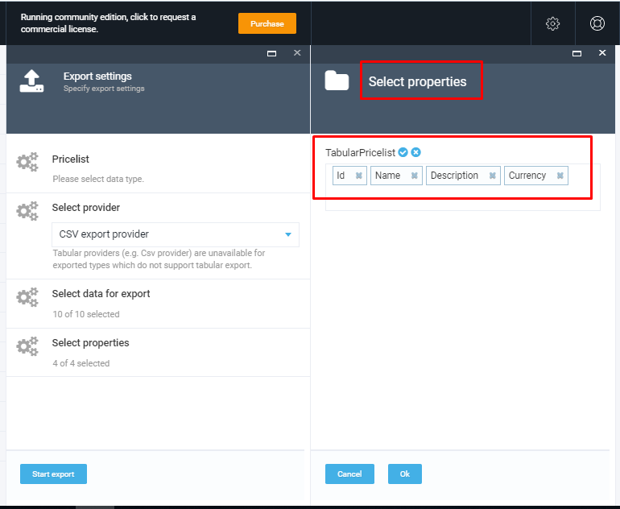

# vc-module-export
Generic export functionality

## Security Settings

The access to Export functionality should be assigned to users by the admin. The admin should first create roles, assign permissions to the created roles and then assign the roles with permissions to the users.

The Export reader role is the role that should be assigned to the user who will be dealing with the Export functionality. This role contains the following main permissions that can be assigned :

1. Export access - this permission allows the user to access the 'Export new' tab;
1. Export download - this permission allows the user to download exported data;
1. Platform:export permission for v2 is needed to allow the download of exported data;
1. 'Pricing export' allows the user to export data to the selected provider;
1. 'Pricing access' allows the user to access Pricing tab;
1. 'Pricing:read' permission allows to read data from the database;
1. Security call API allows the user to use API methods.

In order to create a new user and role, the admin should open the Security tab and manage users and roles.

## Export data

Once the user gets access to Data Export functionality, he can access the 'Export new' tab for data export

In order to start the data export, the user should go through the following steps:

1. Select Object type;
1. Select Export Provider;
1. Select data for export;
1. Select properties;
1. Start export;
1. Download exported data file.

### Select data Object

The user is able to select one of the object types, which are grouped by some creteria.

### Select Export Provider

Json and CSV providers are supported out-of-the-box

**Important** Tabular providers (e.g. Csv provider) are unavailable for exported types which do not support tabular export.

### Select Data For Export

The system allows to select data for export using two approaches:

1. Select ALL data;
1. Select data using the advanced filter.

**Important** Use the [Advanced Filter](/docs/advanced-filter.md) to filter the set of data you need.

### Select Properties

The user should specify which properties he wants to select. There is a possibility to select either all properties or some specific ones simply by removing the properties that should not be included into the export file.

### Start Export

Once the data for export are specified, simply click the 'Start export' button. The system will start the data export, show the export progress and finally display the Export report.
The export file will be available under the link that will be displayed when the export is completed.

License
Copyright (c) Virto Solutions LTD. All rights reserved.

Licensed under the Virto Commerce Open Software License (the "License"); you may not use this file except in compliance with the License. You may obtain a copy of the License at

http://virtocommerce.com/opensourcelicense

Unless required by applicable law or agreed to in writing, software distributed under the License is distributed on an "AS IS" BASIS, WITHOUT WARRANTIES OR CONDITIONS OF ANY KIND, either express or implied.
