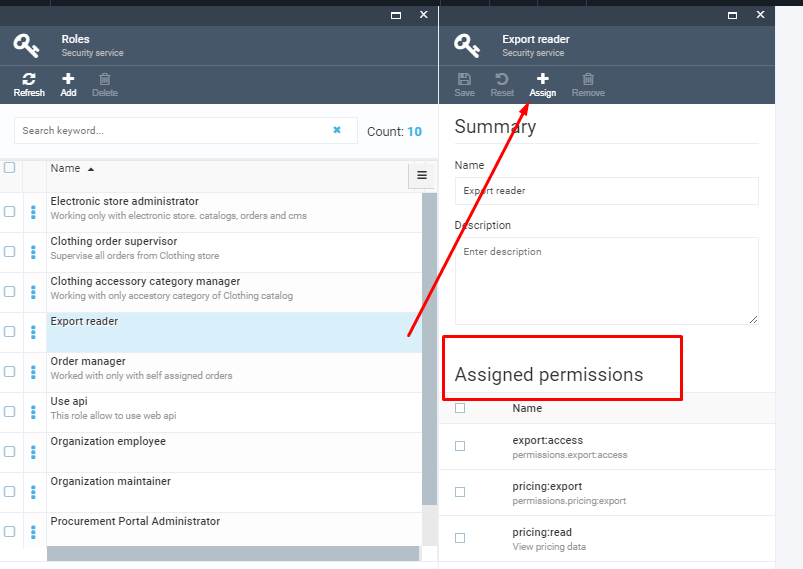
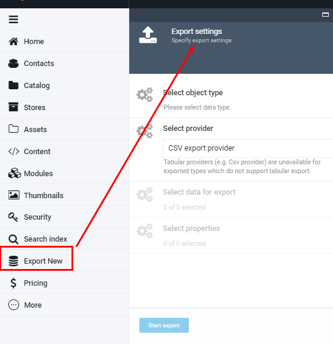
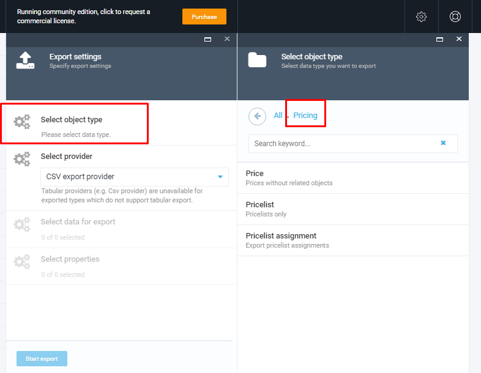
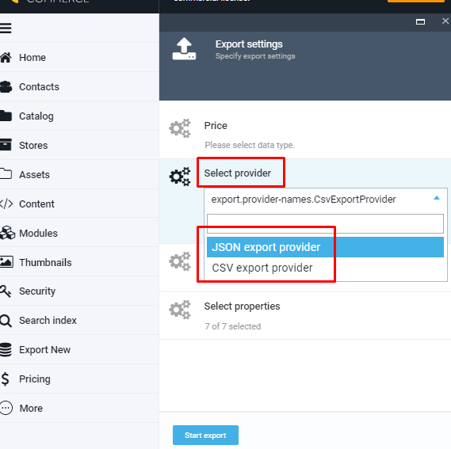
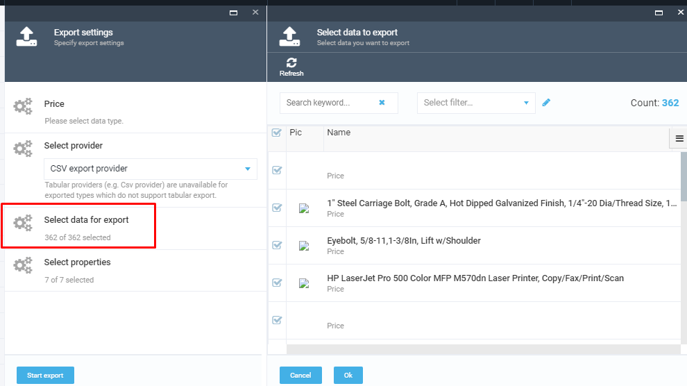
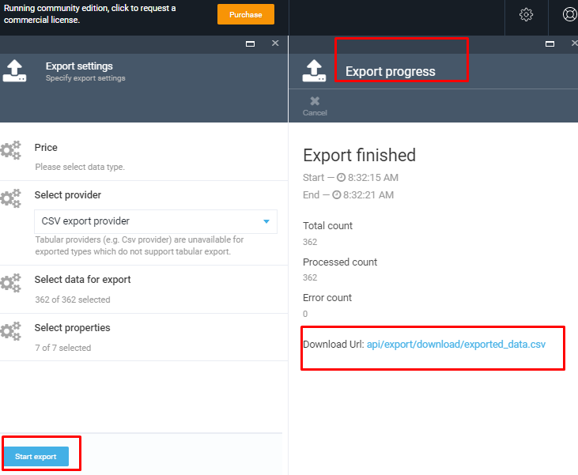

# vc-module-export
Generic export functionality

## Security Settings

The access to Export functionality should be assigned to users by the admin. The admin should first create roles, assign permissions to the created roles and then assign the role with permissions to the users.

The Export reader role is the role that should be assigned to the user who will be dealing with the Export functionality. This role contains the following main permissions that can be assigned :

1. Export access- this permission allows the user to access the 'Export new' folder;
1. Export download- this permission allows the user to download exported data;
1. Security call API;
1. Pricing export allows the user to export prices;
1. Pricing access allows the user to access Pricing folder.

In order to create a new user and role, the admin should open the Security folder and manage users and roles.

## Export data

Once the user gets access to Data Export functionality, he can access the 'Export new' folder for data export

In order to start the data export, the user should go through the following steps:

1. Select Object type;
1. Select Export Provider;
1. Select data for export;
1. Select properties;
1. Start export;
1. Download exported data file.

### Select data Object

1. Click 'Select Object type'
1. Click 'Pricing'
1. Select one of the following options :

        1. Prices
        1. Price lists
        1. Price list assignments 

### Select Export Provider

You can export your data using one of the following export providers:

1. Json
1. CSV

**Important** Tabular providers (e.g. Csv provider) are unavailable for exported types which do not support tabular export.

### Select Data For Export

1. Click on 'Select data for export';
1. Select either ALL data or specific items using the filters;
1. Confirm selection using the 'OK' button.

**Important** Use the [Advanced Filter](/docs/advanced-filter.md) to filter the set of data you need.

### Select Properties

1. Click on 'Select properties';
1. All properties (columns) are selected by default, but you can remove the properties which you don't need to be exported;
1. Confirm selection by clicking the 'OK' button.

### Start Export

Once the data for export are specified, simply click the 'Start export' button. The system will start the data export, show the export progress and finally display the Export report.
The export file will be available under the link that will be available when the export is completed.

License
Copyright (c) Virto Solutions LTD. All rights reserved.

Licensed under the Virto Commerce Open Software License (the "License"); you may not use this file except in compliance with the License. You may obtain a copy of the License at

http://virtocommerce.com/opensourcelicense

Unless required by applicable law or agreed to in writing, software distributed under the License is distributed on an "AS IS" BASIS, WITHOUT WARRANTIES OR CONDITIONS OF ANY KIND, either express or implied.
