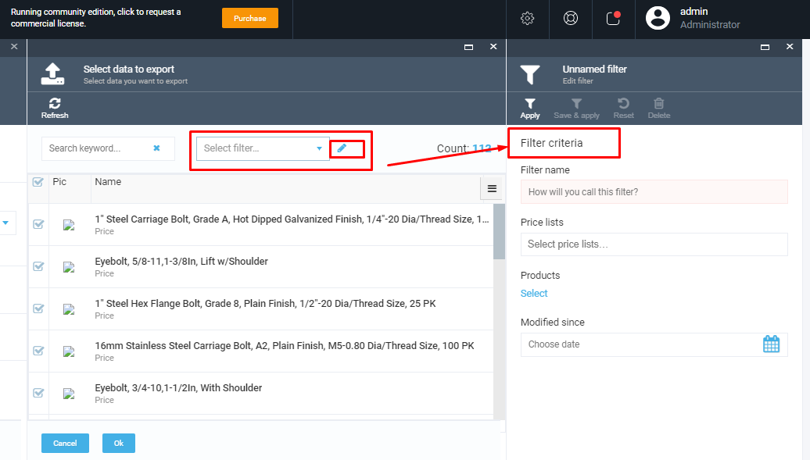
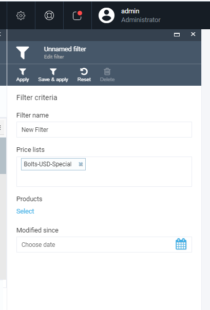
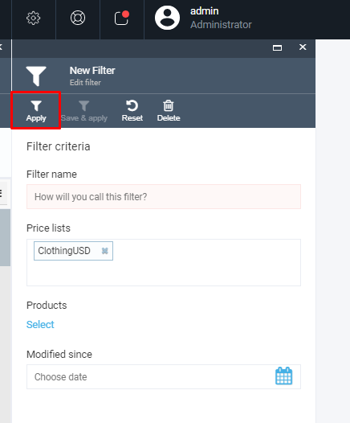
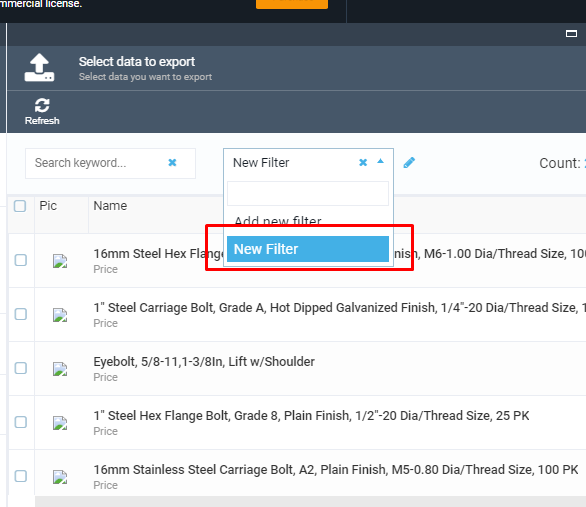
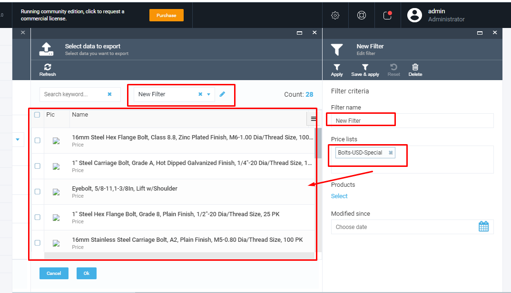
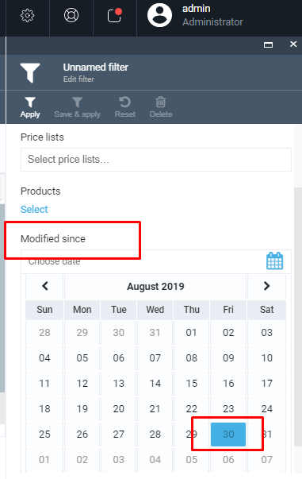

# Advanced Filter

The Advanced Filter allows the user to filter the data using the following filter criteria :

1. Price lists;
1. Select Products;
1. Modified since.

All filter criteria are applied separately. The user can either apply the specified filter or save and apply the selected filter.

## Filter Types

### Filter by price Lists Criteria

1. Open the 'Edit' filter blade 
1. Under 'Price lists' select as many price lists as needed and click the 'Apply' button
1. Select items on the 'Select data to export' blade. You can either select ALL items or some specific items from the list
1. Confirm selection by clicking the 'OK' button
1. The system will apply the filter and close the blade

### Save and Apply Filter

1. Open the 'Edit' filter blade;
1. Enter filter name;
1. Under 'Price lists' select as many price lists as needed and click the 'Save & Apply' button;
1. Select items on the 'Select data to export' blade. You can either select ALL items or some specific items from the list;
1. Confirm selection by clicking the 'OK' button;
1. The system will save and apply the filter and close the blade;
1. The new filter will appear in the list of filter and you can;

### Filter by Products

1. Open 'Edit filter' blade;
1. Select 'Products';
1. Select a catalog and category;
1. Select items and clicks the 'Confirm' button;
1. Click the 'Apply' button;
1. Select the items on 'Select data for export' blade and click 'OK';
1. The filter will be applied and the number of selected items will be displayed (ex, 6 of 365).

### Filter by 'Modified since'

1. Open 'Edit filter' blade;
1. Select the date under 'Modified since' using the date picker and click 'Apply
1. The system will display the filtered data.

