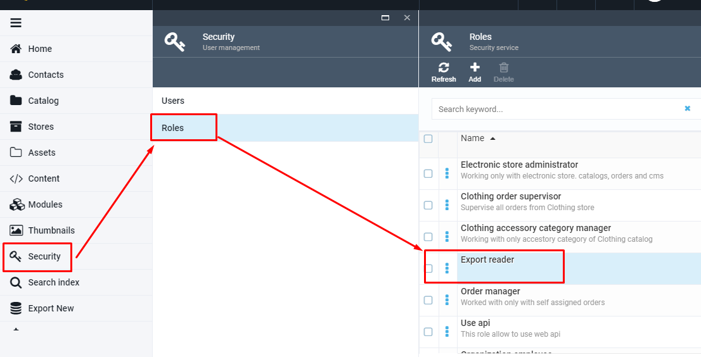
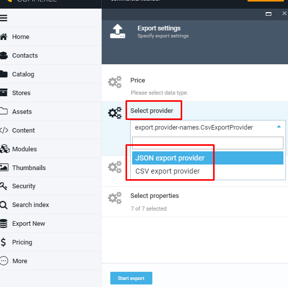
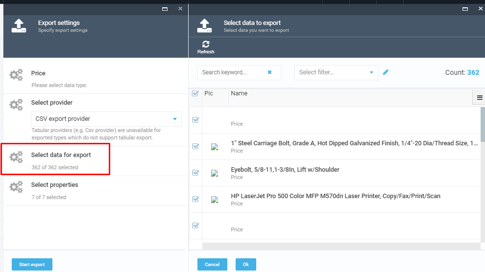

# Overview

The VC Export module provides the ability to export data from Catalog and Pricing modules. Before starting the export, the user can first filter the data by object type and properties, select the export provider using the advanced filter.

## Key Features

1. Role-based functionality- only users with an Export reader role has access to generic export function;
1. Possibility to apply an advanced filter before starting the export;
1. Data can be exported in Json and CSV format.

## Generic export functionality

### Security Settings

The access to Export functionality should be assigned to users by the admin. The admin should first create roles, assign permissions to the created roles and then assign the roles with permissions to the users.

The Export reader role is the role that should be assigned to the user who will be dealing with the Export functionality. Bellow we are giving an example of how the export role permissions are set in Pricing Module:

### General Security Permissions

1. **'Export access'** - this permission allows the user to access the 'Export new' tab;
1. **'Export download'** - this permission allows the user to download exported data;
1. **'Platform:export'** permission for v2 is needed to allow the download of exported data;
1. **'Security call API'** allows the user to use API methods.

### Pricing Specific Security Permissions

1. **'Pricing export'** allows the user to export data to the selected provider;
1. **'Pricing access'** allows the user to access Pricing tab;
1. **'Pricing:read'** permission allows to read data from the database.

In order to create a new user and role, the admin should open the Security tab and manage users and roles.

## Export data

Once the user gets access to Data Export functionality, he can access the 'Export new' tab for data export

In order to start the data export, the user should go through the following steps:

1. Select Object type;
1. Select Export Provider;
1. Select data for export;
1. Select properties;
1. Start export;
1. Download exported data file.

### Select data Object

The user is able to select one of the object types, which are grouped by some criteria.

### Select Export Provider

Json and Csv providers are supported out-of-the-box.

**Important** Tabular providers (e.g. Csv provider) are unavailable for exported types which do not support tabular export.

### Select Data For Export

The system allows to specify data for export, advanced filtering is available.

**Important** Use the [Advanced Filter](advanced-filter.md) to filter the set of data you need.

### Select Properties

The user can specify which properties he wants to select. There is a possibility to keep either ALL properties, which are selected by default  or  some specific ones simply by removing the properties that should not be included into the export file.

### Start Export

Once the data for export are specified, simply click the 'Start export' button. The system will start the data export, show the export progress and finally display the Export report.
The export file will be available under the link that will be displayed when the export is completed.

