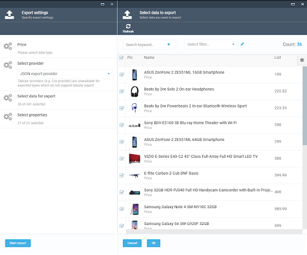
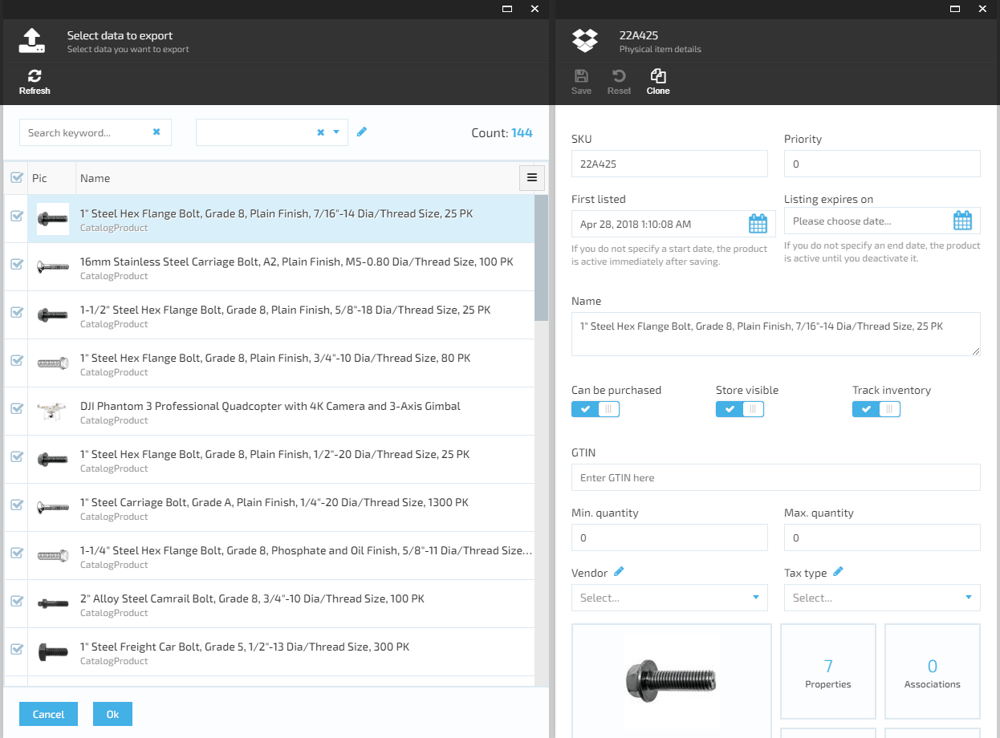

# Guidelines on generic export integration in Custom module
_**Instructions to implement generic export for a custom object type.**_

Table of contents
  * [Overview](#overview)
  * [Server part](#server-part)
    + [Add dependencies](#add-dependencies)
    + [Create exportable type(s)](#create-exportable-type-s-)
    + [Subclass ExportDataQuery](#subclass-exportdataquery)
    + [Implement IPagedDataSource](#implement-ipageddatasource)
    + [Implement IPagedDataSourceFactory](#implement-ipageddatasourcefactory)
    + [Build and register the "Exported Type Definition"](#build-and-register-the--exported-type-definition-)
    + [Define permissions](#define-permissions)
    + [Set metadata](#set-metadata)
    + [Working with extended objects](#working-with-extended-objects)
    + [Export providers](#export-providers)
    + [IExportViewable](#iexportviewable)
  * [UI customization part](#ui-customization-part)
    + [Register filters for exportable data](#register-filters-for-exportable-data)
    + [Register entity viewers](#register-entity-viewers)

## Overview
Export module allows to use generic export functionality in any module. After proper integration, you should be able to export module types data with ability to filter data horizontally (export only subset of data) and vertically (select entity properties you want to export). JSON and CSV data providers are supported out-of-the-box.



## Server part
### Add dependencies
Export module should be added as a dependency in module.manifest.
Required packages to reference in .Data and .Web projects:
* [VirtoCommerce.ExportModule.Core](https://www.nuget.org/packages/VirtoCommerce.ExportModule.Core)
* [VirtoCommerce.ExportModule.Data](https://www.nuget.org/packages/VirtoCommerce.ExportModule.Data)

In case of default export provider overriding, reference to [VirtoCommerce.ExportModule.CsvProvider](https://www.nuget.org/packages/VirtoCommerce.ExportModule.CsvProvider) and/or [VirtoCommerce.ExportModule.JsonProvider](https://www.nuget.org/packages/VirtoCommerce.ExportModule.JsonProvider) package should also be added.

### Create exportable type(s)
A separate class for exportable entity should be defined. It could be a domain model entity descendant or any other class, and it should implement `VirtoCommerce.ExportModule.Core.Model.IExportable` interface.
For instance, exportable class for `Price` in pricing module is [ExportablePrice](https://github.com/VirtoCommerce/vc-module-pricing/blob/v2.18.8/VirtoCommerce.PricingModule.Data/ExportImport/ExportablePrice.cs). There were 2 additional fields (`PricelistName` and `ProductName`) added in order to provide more context for the exported price.

This class described above will be used while exporting to a "common", object-based format like JSON. If possible, it's recommended to implement entity export to a "simple", tabular representation (e.g., CSV) as well. Implementation steps:
1. Define entity class for tabular representation (implementing `IExportable`). E.g., [TabularPrice](https://github.com/VirtoCommerce/vc-module-pricing/blob/v2.18.8/VirtoCommerce.PricingModule.Data/ExportImport/TabularPrice.cs) for Price;
2. Implement `ITabularConvertible` interface on the object-based exportable class. E.g., [ExportablePrice.cs#L42](https://github.com/VirtoCommerce/vc-module-pricing/blob/v2.18.8/VirtoCommerce.PricingModule.Data/ExportImport/ExportablePrice.cs#L42).

### Subclass ExportDataQuery
`VirtoCommerce.ExportModule.Core.Model.ExportDataQuery` is abstract, generic data query class similar to search criteria, often used in VC data services. A descendant of `ExportDataQuery` is needed along with the exportable entity. This descendant would be used for **filtering** while fetching the data from datasource.
E.g., [PriceExportDataQuery.cs](https://github.com/VirtoCommerce/vc-module-pricing/blob/v2.18.8/VirtoCommerce.PricingModule.Data/ExportImport/PriceExportDataQuery.cs) is export data query for prices export.

### Implement IPagedDataSource
Implement `VirtoCommerce.ExportModule.Core.Model.IPagedDataSource`, which is the datasource for export data. Any additional data could be queried here using data access services. For instance, `ProductName` and `PricelistName` properties in `ExportablePrice` are filled using `IItemService` and `IPricingService` respectively.

Two options for `IPagedDataSource` implementation:
1. Extend abstract [ExportPagedDataSource](https://github.com/VirtoCommerce/vc-module-export/blob/v2.2.2/VirtoCommerce.ExportModule.Data/Services/ExportPagedDataSource.cs) class, thus implementing a datasource, which queries **homogenous** data based on **single search criteria** and encapsulates pagination logic, e.g.,  [PriceExportPagedDataSource](https://github.com/VirtoCommerce/vc-module-pricing/blob/v2.18.8/VirtoCommerce.PricingModule.Data/ExportImport/PriceExportPagedDataSource.cs).
2. Or implement `IPagedDataSource` from scratch, possibly supporting **multi-type** export output, **various data sources and queries**, e.g., [Catalog full export datasource](https://github.com/VirtoCommerce/vc-module-catalog/blob/v2.23.23/VirtoCommerce.CatalogModule.Data/ExportImport/CatalogFullExportPagedDataSource.cs).

**Note**: [IEnumerable<IPagedDataSource>.GetItems(int skip, int take)](https://github.com/VirtoCommerce/vc-module-export/blob/v2.2.2/VirtoCommerce.ExportModule.Data/Extensions/IPagedDataSourceCollectionExtensions.cs) extensions could be used for pagination.

### Implement IPagedDataSourceFactory
In order to create datasource using given DataQuery and its dependencies, `IPagedDataSourceFactory` should be implemented and registered. E.g., [factory for Pricing module](https://github.com/VirtoCommerce/vc-module-pricing/blob/dev/VirtoCommerce.PricingModule.Data/ExportImport/PricingExportPagedDataSourceFactory.cs) and [registering DataSourceFactory in Pricing module](https://github.com/VirtoCommerce/vc-module-pricing/blob/dev/VirtoCommerce.PricingModule.Web/Module.cs#L70).

**Best practice**: Instead of creating new factory for each exported type, a single one could be used for all the types. E.g., [CatalogExportPagedDataSourceFactory](https://github.com/VirtoCommerce/vc-module-catalog/blob/v2.23.23/VirtoCommerce.CatalogModule.Data/ExportImport/CatalogExportPagedDataSourceFactory.cs) is used to create all export datasources in Catalog module.

### Build and register the "Exported Type Definition" 
All the required classes has been described already. They should be bound together and comprise `ExportedTypeDefinition`.
A generic 
```
public static ExportedTypeDefinitionBuilder Build<TExport, TDataQuery>()
```
method is used for building the `ExportedTypeDefinition`. The method has the constraints defining exportable object and data query types. Existing extension methods enables further `ExportedTypeDefinition` configuration using fluent API syntax.
The exportable type definition should be registered using `IKnownExportTypesRegistrar.RegisterType(...)` inside `PostInitialize()` method in Module.cs. For instance, [Price export registration and configuration](https://github.com/VirtoCommerce/vc-module-pricing/blob/v2.18.8/VirtoCommerce.PricingModule.Web/Module.cs#L115).

### Define permissions
Access to any data should be restricted by some permission(s). The required permissions are part of `ExportedTypeDefinition` and can be set using `.WithPermissionAuthorization(...)` extension method. E.g., [assigning the required permissions](https://github.com/VirtoCommerce/vc-module-pricing/blob/v2.18.8/VirtoCommerce.PricingModule.Web/Module.cs#L118) to price  export.

If custom (e.g., scope based) authorization is required, an authorization handler should be set using `.WithAuthorizationHandler(...)`. For instance, [setting authorization handler](https://github.com/VirtoCommerce/vc-module-catalog/blob/v2.23.23/VirtoCommerce.CatalogModule.Web/Module.cs#L190) in Catalog full data export.

Technically, both *permission based* and *handler authorizations* are optional, but it's strongly recommended to set at least one of them.

Both (all the assigned permissions and authorization handler) should succeed for successful authorization.

### Set metadata
It's also possible to configure the exportable properties set (metadata) for the exported type. If metadata is set, it could be used for filtering exported data properties. Only selected properties would be added to the output. If metadata is not set, all entity's properties would be exported.
Metadata is set to `ExportedTypeDefinition` by calling `.WithMetadata(...)` in the `ExportedTypeDefinitionBuilder`.
The parameters (properties) for `.WithMetadata()` method could be retrieved from `IExportable` type using [Type.GetPropertyNames()](https://github.com/VirtoCommerce/vc-module-export/blob/v2.2.2/VirtoCommerce.ExportModule.Data/Extensions/ExportedTypeMetadataExtensions.cs#L26) extension.

If exported entity also supports tabular representation (like CSV), `Tabular metadata` should be defined. Similarly to above, `.WithTabularMetadata(...)` method should be called. E.g., [registering metadata for Price export](https://github.com/VirtoCommerce/vc-module-pricing/blob/v2.18.8/VirtoCommerce.PricingModule.Web/Module.cs#L119-L120).

### Working with extended objects
_**Based on [External.PricingModule](https://github.com/VirtoCommerce/vc-samples/tree/master/External.PricingModule) extension module.**_

* Implement descendant for exportable type ([ExportablePriceEx](https://github.com/VirtoCommerce/vc-samples/blob/master/External.PricingModule/External.PricingModule/External.PricingModule.Data/ExportImport/ExportablePriceEx.cs)) and for its tabular representation, if it exists ([TabularPriceEx](https://github.com/VirtoCommerce/vc-samples/blob/master/External.PricingModule/External.PricingModule/External.PricingModule.Data/ExportImport/TabularPriceEx.cs)). 

* Override the both exportable types using `AbstractTypeFactory` and set proper metadata for common and tabular object types, e.g. [for extended Pricing](https://github.com/VirtoCommerce/vc-samples/blob/master/External.PricingModule/External.PricingModule/External.PricingModule.Web/Module.cs#L63-L73).  

* If filling the values for new fields should include additional services:  
  1. Create datasource descendant:  

         PriceExportPagedDataSource2 : PriceExportPagedDataSource

  2. Override `IPricingExportPagedDataSourceFactory` with new implementation which overrides `Create(ExportDataQuery dataQuery)` method to handle `PriceExportDataQuery` using `PriceExportPagedDataSource2`.

### Export providers
Custom export providers could be added in addition to default Json and CSV. It could be done by the following steps:
  
  1. Implement [IExportProvider](https://github.com/VirtoCommerce/vc-module-export/blob/v2.2.2/VirtoCommerce.ExportModule.Core/Services/IExportProvider.cs) interface (e.g. [JsonProvider implementation](https://github.com/VirtoCommerce/vc-module-export/blob/v2.2.2/VirtoCommerce.ExportModule.JsonProvider/JsonExportProvider.cs)).
  2. Register its factory of type `Func<ExportDataRequest, IExportProvider>` in DI container in extension module `Initialize()` method, like [here](https://github.com/VirtoCommerce/vc-module-export/blob/v2.2.2/VirtoCommerce.ExportModule.Web/Module.cs#L34).

### IExportViewable
[IExportViewable](https://github.com/VirtoCommerce/vc-module-export/blob/v2.2.2/VirtoCommerce.ExportModule.Core/Models/IExportViewable.cs) is an interface with common properties for showing entity. It is recommended to be implemented and have its properties filled by all viewable export entities. Example: [ExportablePrice](https://github.com/VirtoCommerce/vc-module-pricing/blob/v2.18.8/VirtoCommerce.PricingModule.Data/ExportImport/ExportablePrice.cs). 

**Best practice**: To reduce the time and size data for preview, consider handling `ExportDataQuery.IsPreview` flag in export data source implemetation to return "light" version of data. [Example](https://github.com/VirtoCommerce/vc-module-catalog/blob/v2.23.23/VirtoCommerce.CatalogModule.Data/ExportImport/ProductExportPagedDataSource.cs#L36).

## UI customization part
### Register filters for exportable data
There is a generic data export UI in Platform Manager. It supports advanced filtering before the data is exported. The filter parameters are rendered depending on the exported entity type and using [metaform](https://virtocommerce.com/docs/vc2devguide/working-with-platform-manager/basic-functions/metaform) directive.
`type.FullName + 'ExportFilter'` should be supplied as a `metaFormName` parameter in `metaFormsService.registerMetaFields(...)` method.
E.g., [registering filters for Price export](https://github.com/VirtoCommerce/vc-module-pricing/blob/v2.18.8/VirtoCommerce.PricingModule.Web/Scripts/pricing.js#L69) in VirtoCommerce.Pricing module.

### Register entity viewers
Entity viewer is a blade that could be shown when selecting specific row in generic viewer. Typically it is blade for view or edit specific entity.



New viewer is registered by calling `registerViewer(...)` method on `virtoCommerce.exportModule.genericViewerItemService` service in AngularJS module's `.run(...) method`. E.g., [registering viewer for Price](https://github.com/VirtoCommerce/vc-module-pricing/blob/v2.18.8/VirtoCommerce.PricingModule.Web/Scripts/pricing.js#L113).
